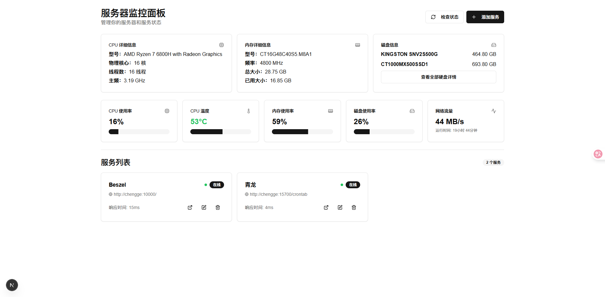

# 🏡 Beautiful Home Page

> 一个现代化的服务器与服务监控面板，基于 Next.js + React + Tailwind CSS 构建，支持硬件信息采集、服务健康监控、极致美观的响应式体验。

---

## ✨ 效果展示



---

## 🚀 项目简介

- 实时展示服务器硬件信息（CPU、内存、磁盘、网络等）
- 支持多服务健康监控，状态一目了然
- 硬盘信息支持下钻，简洁与细节兼得
- 响应式布局，移动端/大屏自适应
- 极简美观的 UI 设计，交互流畅

---

## 🛠️ 技术栈

- [Next.js](https://nextjs.org/) 15
- [React](https://react.dev/) 19
- [Tailwind CSS](https://tailwindcss.com/)
- [Radix UI](https://www.radix-ui.com/) 组件
- [Lucide Icons](https://lucide.dev/)

后端采集：
- Node.js 原生 API + child_process 跨平台采集硬件信息（支持 Windows/Linux/macOS）
- 服务健康检查自动打标

---

## 📦 快速启动

```bash
# 安装依赖
pnpm install

# 启动开发环境
pnpm dev

# 构建生产环境
pnpm build && pnpm start
```

访问：http://localhost:3000

---

## 🏃‍♂️ 生产环境后台运行（推荐）

本项目推荐使用 [pm2](https://pm2.keymetrics.io/) 进行生产环境的进程守护与后台运行。

### 1. 安装 pm2

```bash
npm install -g pm2
```

### 2. 使用后台启动脚本

- **Windows**：

```bash
start.bat
```

- **Mac/Linux**：

```bash
chmod +x start.sh
./start.sh
```

脚本会自动设置端口为 `1215` 并以 pm2 后台守护方式启动服务。

### 3. 常用 pm2 命令

- 查看服务状态：
  ```bash
  pm2 status
  ```
- 停止服务：
  ```bash
  pm2 stop beautiful-home-page
  ```
- 重启服务：
  ```bash
  pm2 restart beautiful-home-page
  ```
- 查看日志：
  ```bash
  pm2 logs beautiful-home-page
  ```

---

## 📁 目录结构

```
├── app/                # Next.js 应用目录
│   ├── api/            # 后端API（硬件采集、服务管理）
│   ├── page.tsx        # 入口页
│   └── ...
├── components/         # 前端组件（仪表盘等）
├── img/                # 效果图与静态资源
├── data/               # 服务数据存储
├── styles/             # 样式文件
├── package.json        # 项目依赖
└── ...
```

---

## 🙏 致谢

- [Next.js](https://nextjs.org/)
- [Tailwind CSS](https://tailwindcss.com/)
- [Radix UI](https://www.radix-ui.com/)
- [Lucide Icons](https://lucide.dev/)

---

> 欢迎 Star & Issue & PR！让你的服务器监控更美观、更高效！ 🚀
